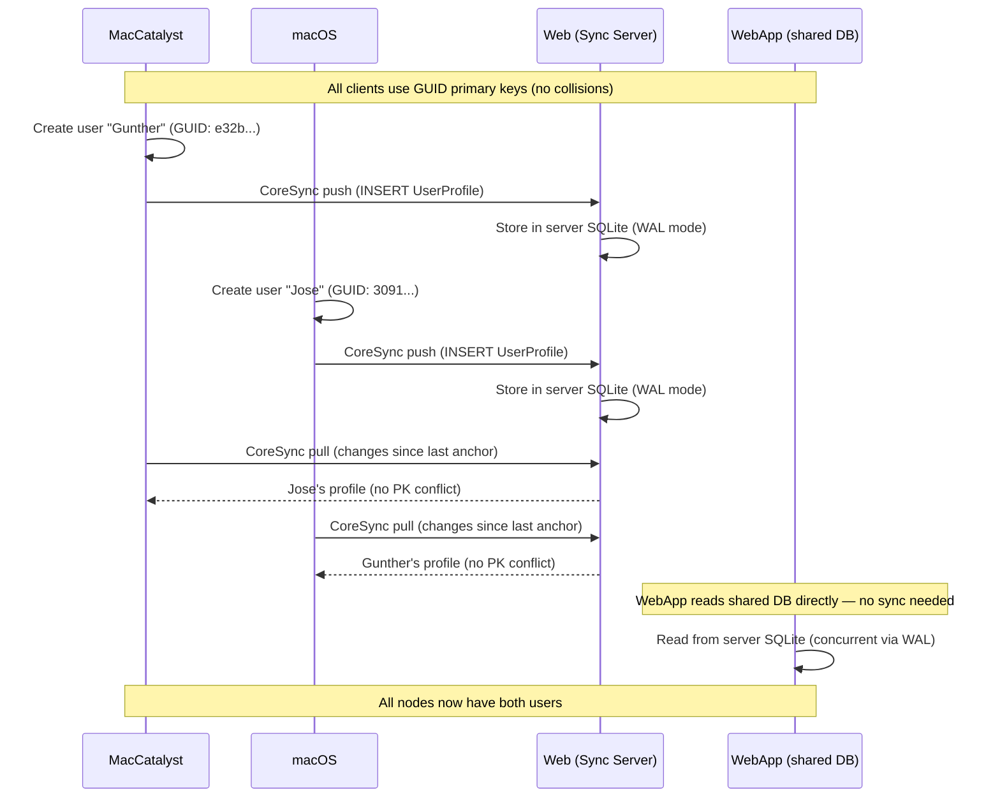

# SentenceStudio Architecture

## System Overview

```mermaid
graph TB
    subgraph Aspire["Aspire AppHost (Orchestration)"]
        direction TB
        Postgres[(PostgreSQL)]
        Redis[(Redis Cache)]
        Blob[(Azure Blob Storage)]
    end

    subgraph ServerSide["Server-Side"]
        Api["SentenceStudio.Api<br/><i>REST API</i><br/>Chat, Speech, Plans"]
        Web["SentenceStudio.Web<br/><i>CoreSync Server</i><br/>Aspire-managed"]
        WebApp["SentenceStudio.WebApp<br/><i>Blazor Server UI</i>"]
        Workers["SentenceStudio.Workers<br/><i>Background Jobs</i>"]
        Marketing["SentenceStudio.Marketing<br/><i>Static Site</i>"]
    end

    subgraph Clients["MAUI Clients (Offline-Capable)"]
        MacCatalyst["MacCatalyst App"]
        MacOS["macOS App"]
        iOS["iOS App"]
        Android["Android App"]
        Windows["Windows App"]
    end

    subgraph External["External Services"]
        OpenAI["OpenAI<br/>gpt-4o-mini"]
        ElevenLabs["ElevenLabs<br/>Text-to-Speech"]
    end

    subgraph DataStores["Data Stores"]
        ServerDB[("Server SQLite (WAL)<br/>sentencestudio.db<br/><i>shared by Web + WebApp</i>")]
        CatalystDB[("MacCatalyst SQLite<br/>sstudio.db3")]
        MacOSDB[("macOS SQLite<br/>sstudio.db3")]
        iOSDB[("iOS SQLite<br/>sstudio.db3")]
        AndroidDB[("Android SQLite<br/>sstudio.db3")]
        WinDB[("Windows SQLite<br/>sstudio.db3")]
    end

    %% Aspire orchestrates server-side services
    Aspire --> Api
    Aspire --> Web
    Aspire --> WebApp
    Aspire --> Workers
    Aspire --> Marketing

    %% Api calls external AI services
    Api -->|IChatClient| OpenAI
    Api -->|TTS| ElevenLabs

    %% WebApp calls Api for AI and shares the server DB
    WebApp -->|HTTP API| Api
    WebApp ---|shared DB| ServerDB

    %% Workers use Aspire infrastructure
    Workers --> Postgres
    Workers --> Redis
    Workers --> Blob
    Workers -->|HTTP API| Api

    %% Web (sync server) owns the server DB
    Web --- ServerDB

    %% MAUI clients have local SQLite + sync
    MacCatalyst --- CatalystDB
    MacOS --- MacOSDB
    iOS --- iOSDB
    Android --- AndroidDB
    Windows --- WinDB

    %% MAUI clients sync bidirectionally with Web
    MacCatalyst <-->|CoreSync| Web
    MacOS <-->|CoreSync| Web
    iOS <-->|CoreSync| Web
    Android <-->|CoreSync| Web
    Windows <-->|CoreSync| Web

    %% MAUI clients call Api for AI features
    MacCatalyst -->|HTTP API| Api
    MacOS -->|HTTP API| Api
    iOS -->|HTTP API| Api
    Android -->|HTTP API| Api
    Windows -->|HTTP API| Api

    %% MAUI clients also have local IChatClient (offline)
    MacCatalyst -.->|local IChatClient| OpenAI
    MacOS -.->|local IChatClient| OpenAI
    iOS -.->|local IChatClient| OpenAI
    Android -.->|local IChatClient| OpenAI
    Windows -.->|local IChatClient| OpenAI

    %% Styling
    classDef aspire fill:#4a90d9,stroke:#2c5f8a,color:#fff
    classDef server fill:#5ba55b,stroke:#3d7a3d,color:#fff
    classDef client fill:#d4944a,stroke:#a06b30,color:#fff
    classDef external fill:#9b59b6,stroke:#7d3c98,color:#fff
    classDef db fill:#f0f0f0,stroke:#999,color:#333

    class Postgres,Redis,Blob aspire
    class Api,Web,WebApp,Workers,Marketing server
    class MacCatalyst,MacOS,iOS,Android,Windows client
    class OpenAI,ElevenLabs external
    class ServerDB,CatalystDB,MacOSDB,iOSDB,AndroidDB,WinDB db
```

## Data Flow: CoreSync

## Project Responsibilities

| Project | Role | Data Store | Calls | Exposes |
|---------|------|-----------|-------|---------|
| **AppHost** | Aspire orchestrator | Postgres, Redis, Blob | — | Dashboard |
| **Api** | REST API gateway | None (stateless) | OpenAI, ElevenLabs | `/api/v1/ai/chat`, `/api/v1/ai/chat-messages`, `/api/v1/ai/analyze-image`, `/api/v1/speech/synthesize`, `/api/v1/plans/generate` |
| **Web** | CoreSync sync server | Server SQLite (shared, WAL) | — | CoreSync HTTP endpoints |
| **WebApp** | Blazor Server UI | Server SQLite (shared, WAL) | Api | Blazor pages |
| **Workers** | Background jobs | Postgres, Redis, Blob | Api | — |
| **Marketing** | Static marketing site | None | — | Razor pages |
| **MacCatalyst** | MAUI desktop client | Local SQLite | Api, Web (sync), OpenAI | — |
| **macOS** | MAUI desktop client | Local SQLite | Api, Web (sync), OpenAI | — |
| **iOS** | MAUI mobile client | Local SQLite | Api, Web (sync), OpenAI | — |
| **Android** | MAUI mobile client | Local SQLite | Api, Web (sync), OpenAI | — |
| **Windows** | MAUI desktop client | Local SQLite | Api, Web (sync), OpenAI | — |

## Shared Libraries

| Library | Purpose |
|---------|---------|
| **SentenceStudio.Shared** | EF Core models, DbContext, repositories, services, CoreSync sync service |
| **SentenceStudio.AppLib** | MAUI app builder, service registration, CoreSync client config, API clients |
| **SentenceStudio.UI** | Blazor Razor components (shared between WebApp and MAUI Blazor WebView) |
| **SentenceStudio.Contracts** | Shared DTOs and API request/response models |
| **SentenceStudio.ServiceDefaults** | Aspire service defaults (OpenTelemetry, health checks) |
| **SentenceStudio.Domain** | Domain logic |

## Architecture Decisions

### WebApp shares the server database (WAL mode)
The WebApp is always server-side and always online. Instead of maintaining a separate SQLite database and syncing via CoreSync, it reads/writes the same database as the sync server. SQLite WAL (Write-Ahead Logging) enables concurrent reads from both processes.

### MAUI clients sync via CoreSync with GUID PKs
All synced entities use string GUID primary keys to prevent cross-client collisions. CoreSync handles bidirectional sync with INSERT conflicts resolved as Skip (same GUID = same record).

### IChatClient remains in WebApp temporarily
`ConversationAgentService` requires `IChatClient` directly for multi-turn conversation with `ConversationMemory` middleware pipeline. Routing this through the REST API requires refactoring the agent pipeline. The WebApp retains its own `IChatClient` registration until that work is done. All other AI services route through the Api.

### Sync server managed by Aspire
The `SentenceStudio.Web` sync server is registered in the Aspire AppHost and starts automatically with `aspire run`. MAUI clients read the sync URL from environment variables or fall back to `localhost:5240`.

