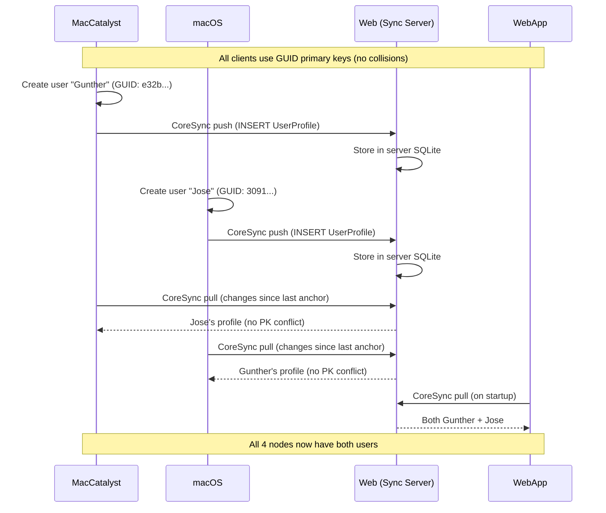

# SentenceStudio Architecture

## System Overview

```mermaid
graph TB
    subgraph Aspire["Aspire AppHost (Orchestration)"]
        direction TB
        Postgres[(PostgreSQL)]
        Redis[(Redis Cache)]
        Blob[(Azure Blob Storage)]
    end

    subgraph ServerSide["Server-Side"]
        Api["SentenceStudio.Api<br/><i>REST API</i><br/>Chat, Speech, Plans"]
        Web["SentenceStudio.Web<br/><i>CoreSync Server</i><br/>port 5240"]
        WebApp["SentenceStudio.WebApp<br/><i>Blazor Server UI</i>"]
        Workers["SentenceStudio.Workers<br/><i>Background Jobs</i>"]
        Marketing["SentenceStudio.Marketing<br/><i>Static Site</i>"]
    end

    subgraph Clients["MAUI Clients (Offline-Capable)"]
        MacCatalyst["MacCatalyst App"]
        MacOS["macOS App"]
        Windows["Windows App"]
    end

    subgraph External["External Services"]
        OpenAI["OpenAI<br/>gpt-4o-mini"]
        ElevenLabs["ElevenLabs<br/>Text-to-Speech"]
    end

    subgraph DataStores["Local Data Stores"]
        ServerDB[("Server SQLite<br/>sentencestudio.db")]
        WebAppDB[("WebApp SQLite<br/>sstudio-webapp.db3")]
        CatalystDB[("MacCatalyst SQLite<br/>sstudio.db3")]
        MacOSDB[("macOS SQLite<br/>sstudio.db3")]
        WinDB[("Windows SQLite<br/>sstudio.db3")]
    end

    %% Aspire orchestrates server-side services
    Aspire --> Api
    Aspire --> WebApp
    Aspire --> Workers
    Aspire --> Marketing

    %% Api calls external AI services
    Api -->|IChatClient| OpenAI
    Api -->|TTS| ElevenLabs

    %% WebApp calls Api for AI and currently syncs with Web
    WebApp -->|HTTP API| Api
    WebApp -.->|CoreSync client| Web

    %% Workers use Aspire infrastructure
    Workers --> Postgres
    Workers --> Redis
    Workers --> Blob
    Workers -->|HTTP API| Api

    %% Web (sync server) owns the server DB
    Web --- ServerDB

    %% WebApp has its own DB (current state - should share server DB)
    WebApp --- WebAppDB

    %% MAUI clients have local SQLite + sync
    MacCatalyst --- CatalystDB
    MacOS --- MacOSDB
    Windows --- WinDB

    %% MAUI clients sync bidirectionally with Web
    MacCatalyst <-->|CoreSync| Web
    MacOS <-->|CoreSync| Web
    Windows <-->|CoreSync| Web

    %% MAUI clients call Api for AI features
    MacCatalyst -->|HTTP API| Api
    MacOS -->|HTTP API| Api
    Windows -->|HTTP API| Api

    %% MAUI clients also have local IChatClient (offline)
    MacCatalyst -.->|local IChatClient| OpenAI
    MacOS -.->|local IChatClient| OpenAI
    Windows -.->|local IChatClient| OpenAI

    %% Styling
    classDef aspire fill:#4a90d9,stroke:#2c5f8a,color:#fff
    classDef server fill:#5ba55b,stroke:#3d7a3d,color:#fff
    classDef client fill:#d4944a,stroke:#a06b30,color:#fff
    classDef external fill:#9b59b6,stroke:#7d3c98,color:#fff
    classDef db fill:#f0f0f0,stroke:#999,color:#333

    class Postgres,Redis,Blob aspire
    class Api,Web,WebApp,Workers,Marketing server
    class MacCatalyst,MacOS,Windows client
    class OpenAI,ElevenLabs external
    class ServerDB,WebAppDB,CatalystDB,MacOSDB,WinDB db
```

## Data Flow: CoreSync

## Project Responsibilities

| Project | Role | Data Store | Calls | Exposes |
|---------|------|-----------|-------|---------|
| **AppHost** | Aspire orchestrator | Postgres, Redis, Blob | — | Dashboard |
| **Api** | REST API gateway | None (stateless) | OpenAI, ElevenLabs | `/api/v1/ai/chat`, `/api/v1/speech/synthesize`, `/api/v1/plans/generate` |
| **Web** | CoreSync sync server | Server SQLite | — | CoreSync HTTP endpoints |
| **WebApp** | Blazor Server UI | WebApp SQLite ⚠️ | Api, Web (sync) | Blazor pages |
| **Workers** | Background jobs | Postgres, Redis, Blob | Api | — |
| **Marketing** | Static marketing site | None | — | Razor pages |
| **MacCatalyst** | MAUI desktop client | Local SQLite | Api, Web (sync), OpenAI | — |
| **macOS** | MAUI desktop client | Local SQLite | Api, Web (sync), OpenAI | — |
| **Windows** | MAUI desktop client | Local SQLite | Api, Web (sync), OpenAI | — |

## Shared Libraries

| Library | Purpose |
|---------|---------|
| **SentenceStudio.Shared** | EF Core models, DbContext, repositories, services, CoreSync sync service |
| **SentenceStudio.AppLib** | MAUI app builder, service registration, CoreSync client config, API clients |
| **SentenceStudio.UI** | Blazor Razor components (shared between WebApp and MAUI Blazor WebView) |
| **SentenceStudio.Contracts** | Shared DTOs and interfaces |
| **SentenceStudio.ServiceDefaults** | Aspire service defaults (OpenTelemetry, health checks) |
| **SentenceStudio.Domain** | Domain logic |

## Known Architecture Issues

### ⚠️ WebApp has a redundant SQLite database

The WebApp currently runs its own SQLite database (`sstudio-webapp.db3`) and syncs with the Web sync server via CoreSync. Since the WebApp is server-side (always online), it should instead read/write the sync server's database directly — or both should share Postgres.

### ⚠️ IChatClient is registered in multiple places

`IChatClient` (OpenAI) is registered independently in:
- **Api** — the intended gateway for AI calls
- **WebApp** — redundant local registration
- **MAUI clients** (via AppLib) — needed for offline capability

The WebApp should route all AI calls through the Api rather than having its own `IChatClient`.

### ⚠️ Web sync server is not in Aspire AppHost

The `SentenceStudio.Web` sync server must be started separately (`dotnet run` on port 5240). It's not orchestrated by Aspire, which means it's easy to forget to start it.
