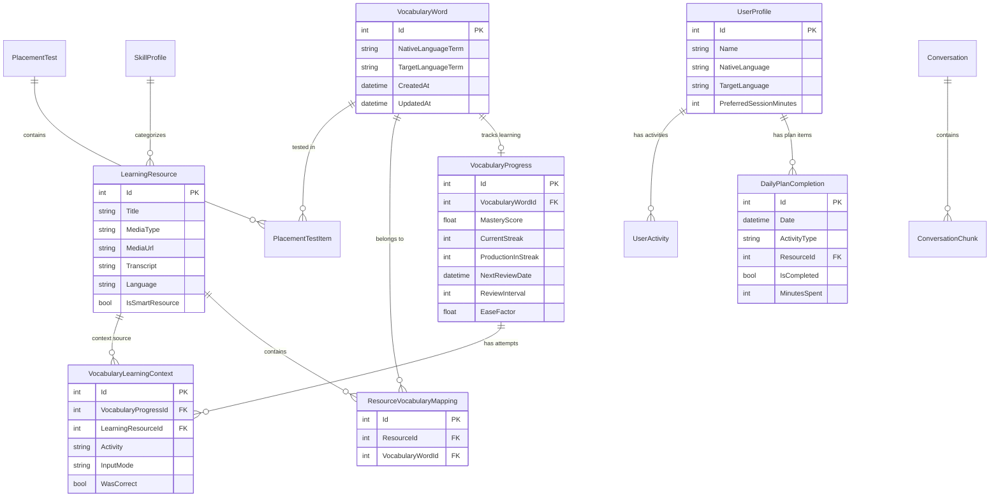

# SentenceStudio Data Schema

> **Purpose**: This document describes the data structure of the SentenceStudio language learning application. It's designed to be shared with LLMs for context about the application's data model.
>
> **Last Generated**: 2025-12-11
>
> **Database**: SQLite via Entity Framework Core

---

## Entity Relationship Diagram



---

## Core Entities

### VocabularyWord
**Purpose**: Stores individual vocabulary terms being learned (word pairs between native and target language).

| Property | Type | Constraints | Description |
|----------|------|-------------|-------------|
| Id | int | PK, Auto | Unique identifier |
| NativeLanguageTerm | string? | - | Word in learner's native language (e.g., "hello") |
| TargetLanguageTerm | string? | - | Word in target language (e.g., "안녕하세요") |
| CreatedAt | DateTime | Required | When the word was added |
| UpdatedAt | DateTime | Required | Last modification time |

**Sample Data**:
```json
[
  { "Id": 1, "NativeLanguageTerm": "hello", "TargetLanguageTerm": "안녕하세요", "CreatedAt": "2025-01-15T10:00:00Z" },
  { "Id": 2, "NativeLanguageTerm": "thank you", "TargetLanguageTerm": "감사합니다", "CreatedAt": "2025-01-15T10:00:00Z" },
  { "Id": 3, "NativeLanguageTerm": "water", "TargetLanguageTerm": "물", "CreatedAt": "2025-01-16T14:30:00Z" }
]
```

---

### VocabularyProgress
**Purpose**: Tracks learning progress for each vocabulary word using spaced repetition (SM-2 algorithm) and streak-based mastery.

| Property | Type | Constraints | Description |
|----------|------|-------------|-------------|
| Id | int | PK, Auto | Unique identifier |
| VocabularyWordId | int | FK, Unique | One progress record per word |
| UserId | int | Default: 1 | User who owns this progress |
| MasteryScore | float | 0.0-1.0 | Overall mastery level |
| TotalAttempts | int | ≥0 | Total practice attempts |
| CorrectAttempts | int | ≥0 | Successful attempts |
| CurrentStreak | int | ≥0 | Consecutive correct answers |
| ProductionInStreak | int | ≥0 | Production-mode attempts in current streak |
| NextReviewDate | DateTime? | - | When word is due for SRS review |
| ReviewInterval | int | Days | Current SRS interval |
| EaseFactor | float | Default: 2.5 | SM-2 ease factor (difficulty modifier) |
| FirstSeenAt | DateTime | Required | When word was first practiced |
| LastPracticedAt | DateTime | Required | Most recent practice |
| MasteredAt | DateTime? | - | When word reached "known" status |

**Computed Properties**:
- `Status`: `Unknown` (never seen) → `Learning` (in progress) → `Known` (mastered)
- `IsKnown`: `true` when `MasteryScore >= 0.85 AND ProductionInStreak >= 2`
- `IsDueForReview`: `true` when `NextReviewDate <= DateTime.UtcNow`

**Sample Data**:
```json
[
  {
    "Id": 1,
    "VocabularyWordId": 1,
    "MasteryScore": 0.92,
    "CurrentStreak": 5,
    "ProductionInStreak": 3,
    "NextReviewDate": "2025-12-15T00:00:00Z",
    "ReviewInterval": 7,
    "EaseFactor": 2.6,
    "Status": "Known"
  },
  {
    "Id": 2,
    "VocabularyWordId": 2,
    "MasteryScore": 0.45,
    "CurrentStreak": 1,
    "ProductionInStreak": 0,
    "NextReviewDate": "2025-12-12T00:00:00Z",
    "ReviewInterval": 1,
    "EaseFactor": 2.3,
    "Status": "Learning"
  }
]
```

---

### LearningResource
**Purpose**: Content containers that hold vocabulary lists, podcasts, videos, or other learning materials.

| Property | Type | Constraints | Description |
|----------|------|-------------|-------------|
| Id | int | PK, Auto | Unique identifier |
| Title | string? | - | Display name |
| Description | string? | - | What this resource covers |
| MediaType | string? | - | "Vocabulary List", "podcast", "video", "article" |
| MediaUrl | string? | - | URL to external content |
| Transcript | string? | - | Full text/transcript content |
| Translation | string? | - | Optional native language translation |
| Language | string? | - | Target language (e.g., "Korean") |
| SkillID | int? | FK | Associated skill category |
| Tags | string? | - | Comma-separated tags |
| IsSmartResource | bool | Default: false | System-generated dynamic resource |
| SmartResourceType | string? | - | "DailyReview", "NewWords", "Struggling" |
| CreatedAt | DateTime | Required | When resource was created |
| UpdatedAt | DateTime | Required | Last modification |

**Sample Data**:
```json
[
  {
    "Id": 1,
    "Title": "TTMIK Level 1 Lesson 1",
    "MediaType": "Vocabulary List",
    "Language": "Korean",
    "IsSmartResource": false
  },
  {
    "Id": 2,
    "Title": "Daily Review - Due Words",
    "MediaType": "Vocabulary List",
    "IsSmartResource": true,
    "SmartResourceType": "DailyReview"
  }
]
```

---

### ResourceVocabularyMapping
**Purpose**: Join table linking vocabulary words to learning resources (many-to-many).

| Property | Type | Constraints | Description |
|----------|------|-------------|-------------|
| Id | int | PK, Auto | Unique identifier |
| ResourceId | int | FK | Learning resource |
| VocabularyWordId | int | FK | Vocabulary word |

---

### VocabularyLearningContext
**Purpose**: Records each individual practice attempt with detailed context about how the word was practiced.

| Property | Type | Constraints | Description |
|----------|------|-------------|-------------|
| Id | int | PK, Auto | Unique identifier |
| VocabularyProgressId | int | FK | Parent progress record |
| LearningResourceId | int? | FK | Resource used (null = isolated practice) |
| Activity | string | Required | Activity type (see enum below) |
| InputMode | string | Required | How user responded |
| WasCorrect | bool | Required | Whether attempt was successful |
| DifficultyScore | float | 0.0-1.0 | Calculated difficulty |
| ResponseTimeMs | int | ≥0 | Time to answer in milliseconds |
| UserConfidence | float? | 0.0-1.0 | Optional self-assessment |
| ContextType | string? | - | "Isolated", "Sentence", "Conjugated" |
| UserInput | string? | - | What user entered |
| ExpectedAnswer | string? | - | Correct answer |
| LearnedAt | DateTime | Required | When this attempt occurred |
| CorrectAnswersInContext | int | ≥0 | Streak within this context |

**Sample Data**:
```json
[
  {
    "Id": 1,
    "VocabularyProgressId": 1,
    "LearningResourceId": 1,
    "Activity": "VocabularyQuiz",
    "InputMode": "MultipleChoice",
    "WasCorrect": true,
    "DifficultyScore": 0.3,
    "ResponseTimeMs": 2500,
    "ContextType": "Isolated",
    "LearnedAt": "2025-12-10T15:30:00Z"
  }
]
```

---

### DailyPlanCompletion
**Purpose**: Tracks daily learning plan items and their completion status.

| Property | Type | Constraints | Description |
|----------|------|-------------|-------------|
| Id | int | PK, Auto | Unique identifier |
| Date | DateTime | Required | Plan date |
| PlanItemId | string | Required | Unique ID for this plan item |
| ActivityType | string | Required | Maps to PlanActivityType enum |
| ResourceId | int? | FK | Associated learning resource |
| SkillId | int? | FK | Associated skill |
| IsCompleted | bool | Default: false | Completion status |
| CompletedAt | DateTime? | - | When marked complete |
| MinutesSpent | int | ≥0 | Actual time spent |
| EstimatedMinutes | int | ≥0 | Planned duration |
| Priority | int | 1-10 | Item importance |
| TitleKey | string | Required | Localization key for title |
| DescriptionKey | string | Required | Localization key for description |
| Rationale | string? | - | LLM-generated explanation |

---

### UserProfile
**Purpose**: User settings and preferences.

| Property | Type | Constraints | Description |
|----------|------|-------------|-------------|
| Id | int | PK, Auto | Unique identifier |
| Name | string? | - | Display name |
| NativeLanguage | string | Default: "English" | User's native language |
| TargetLanguage | string | Default: "Korean" | Language being learned |
| DisplayLanguage | string? | - | UI language preference |
| Email | string? | - | Contact email |
| OpenAI_APIKey | string? | - | User's API key |
| PreferredSessionMinutes | int | Default: 20 | Desired daily practice time |
| TargetCEFRLevel | string? | - | Learning goal (A1-C2) |
| CreatedAt | DateTime | Required | Account creation |

---

### UserActivity
**Purpose**: High-level activity log for analytics and tracking.

| Property | Type | Constraints | Description |
|----------|------|-------------|-------------|
| Id | int | PK, Auto | Unique identifier |
| Activity | string? | - | Activity type performed |
| Input | string? | - | User's response/input |
| Fluency | double | 0-100 | Fluency score |
| Accuracy | double | 0-100 | Accuracy score |
| CreatedAt | DateTime | Required | When activity occurred |

---

### PlacementTest / PlacementTestItem
**Purpose**: Initial vocabulary assessment to determine starting level.

**PlacementTest**:
| Property | Type | Description |
|----------|------|-------------|
| Id | int | PK |
| UserId | int | Test taker |
| TestType | enum | QuickRecognition, AdaptiveRecognition, HybridAssessment |
| Status | enum | NotStarted, InProgress, Completed, Cancelled |
| TotalItemsPresented | int | Questions shown |
| TotalCorrect | int | Correct answers |
| EstimatedVocabularySizeMin/Max | int | Vocabulary size range |
| EstimatedCEFRLevel | string? | A1-C2 estimate |

**PlacementTestItem**:
| Property | Type | Description |
|----------|------|-------------|
| Id | int | PK |
| PlacementTestId | int | FK to test |
| VocabularyWordId | int | FK to word tested |
| ItemType | enum | Recognition or Production |
| IsCorrect | bool | Result |
| ResponseTimeMs | int | Answer speed |

---

## Enums

### Activity Types
```
Warmup, Writer, SceneDescription, StoryTelling, SyntacticAnalysis, 
Translation, Shadowing, VocabularyMatching, Clozure, HowDoYouSay, 
VocabularyQuiz, Reading, VideoWatching
```

### Input Modes
```
MultipleChoice, Text, Voice
```

### Plan Activity Types
```
VocabularyReview, Reading, Listening, VideoWatching, Shadowing, 
Cloze, Translation, Writing, SceneDescription, Conversation, VocabularyGame
```

### Learning Status
```
Unknown (never seen), Learning (in progress), Known (mastered)
```

### Learning Phase
```
Recognition (passive recall), Production (active recall), Application (in context)
```

---

## Business Logic Reference

### Mastery Scoring
- **Known threshold**: MasteryScore ≥ 0.85 AND ProductionInStreak ≥ 2
- **Production weight**: Production attempts (typing/speaking) count more than recognition (multiple choice)
- **Streak reset**: Any incorrect answer resets CurrentStreak and ProductionInStreak to 0

### Spaced Repetition (SM-2)
- **Initial interval**: 1 day
- **EaseFactor range**: 1.3 to 2.5+ (lower = harder word)
- **Interval calculation**: `ReviewInterval * EaseFactor` after correct answer
- **Due for review**: `NextReviewDate <= DateTime.UtcNow`

### Smart Resources
- **DailyReview**: Auto-generated list of words due for SRS review
- **NewWords**: Recently added words not yet practiced
- **Struggling**: Words with low mastery or frequently incorrect

### Daily Plan Generation
- Target: `UserProfile.PreferredSessionMinutes` (default 20 min)
- Priority: Due vocabulary → new content → skill practice
- Activities are sized to fit within time budget

---

## JSON Schema (for LLM code generation)

```json
{
  "$schema": "http://json-schema.org/draft-07/schema#",
  "definitions": {
    "VocabularyWord": {
      "type": "object",
      "properties": {
        "Id": { "type": "integer" },
        "NativeLanguageTerm": { "type": ["string", "null"] },
        "TargetLanguageTerm": { "type": ["string", "null"] },
        "CreatedAt": { "type": "string", "format": "date-time" },
        "UpdatedAt": { "type": "string", "format": "date-time" }
      },
      "required": ["Id", "CreatedAt", "UpdatedAt"]
    },
    "VocabularyProgress": {
      "type": "object",
      "properties": {
        "Id": { "type": "integer" },
        "VocabularyWordId": { "type": "integer" },
        "UserId": { "type": "integer", "default": 1 },
        "MasteryScore": { "type": "number", "minimum": 0, "maximum": 1 },
        "TotalAttempts": { "type": "integer", "minimum": 0 },
        "CorrectAttempts": { "type": "integer", "minimum": 0 },
        "CurrentStreak": { "type": "integer", "minimum": 0 },
        "ProductionInStreak": { "type": "integer", "minimum": 0 },
        "NextReviewDate": { "type": ["string", "null"], "format": "date-time" },
        "ReviewInterval": { "type": "integer", "minimum": 0 },
        "EaseFactor": { "type": "number", "default": 2.5 },
        "FirstSeenAt": { "type": "string", "format": "date-time" },
        "LastPracticedAt": { "type": "string", "format": "date-time" },
        "MasteredAt": { "type": ["string", "null"], "format": "date-time" }
      },
      "required": ["Id", "VocabularyWordId", "MasteryScore"]
    },
    "LearningResource": {
      "type": "object",
      "properties": {
        "Id": { "type": "integer" },
        "Title": { "type": ["string", "null"] },
        "Description": { "type": ["string", "null"] },
        "MediaType": { "type": ["string", "null"], "enum": ["Vocabulary List", "podcast", "video", "article", null] },
        "MediaUrl": { "type": ["string", "null"] },
        "Transcript": { "type": ["string", "null"] },
        "Translation": { "type": ["string", "null"] },
        "Language": { "type": ["string", "null"] },
        "SkillID": { "type": ["integer", "null"] },
        "Tags": { "type": ["string", "null"] },
        "IsSmartResource": { "type": "boolean", "default": false },
        "SmartResourceType": { "type": ["string", "null"], "enum": ["DailyReview", "NewWords", "Struggling", null] }
      },
      "required": ["Id"]
    },
    "VocabularyLearningContext": {
      "type": "object",
      "properties": {
        "Id": { "type": "integer" },
        "VocabularyProgressId": { "type": "integer" },
        "LearningResourceId": { "type": ["integer", "null"] },
        "Activity": { "type": "string" },
        "InputMode": { "type": "string", "enum": ["MultipleChoice", "Text", "Voice"] },
        "WasCorrect": { "type": "boolean" },
        "DifficultyScore": { "type": "number", "minimum": 0, "maximum": 1 },
        "ResponseTimeMs": { "type": "integer", "minimum": 0 },
        "UserConfidence": { "type": ["number", "null"], "minimum": 0, "maximum": 1 },
        "ContextType": { "type": ["string", "null"], "enum": ["Isolated", "Sentence", "Conjugated", null] },
        "UserInput": { "type": ["string", "null"] },
        "ExpectedAnswer": { "type": ["string", "null"] },
        "LearnedAt": { "type": "string", "format": "date-time" }
      },
      "required": ["Id", "VocabularyProgressId", "Activity", "InputMode", "WasCorrect", "LearnedAt"]
    },
    "DailyPlanCompletion": {
      "type": "object",
      "properties": {
        "Id": { "type": "integer" },
        "Date": { "type": "string", "format": "date-time" },
        "PlanItemId": { "type": "string" },
        "ActivityType": { "type": "string" },
        "ResourceId": { "type": ["integer", "null"] },
        "SkillId": { "type": ["integer", "null"] },
        "IsCompleted": { "type": "boolean", "default": false },
        "CompletedAt": { "type": ["string", "null"], "format": "date-time" },
        "MinutesSpent": { "type": "integer", "minimum": 0 },
        "EstimatedMinutes": { "type": "integer", "minimum": 0 },
        "Priority": { "type": "integer", "minimum": 1, "maximum": 10 },
        "TitleKey": { "type": "string" },
        "DescriptionKey": { "type": "string" },
        "Rationale": { "type": ["string", "null"] }
      },
      "required": ["Id", "Date", "PlanItemId", "ActivityType"]
    },
    "UserProfile": {
      "type": "object",
      "properties": {
        "Id": { "type": "integer" },
        "Name": { "type": ["string", "null"] },
        "NativeLanguage": { "type": "string", "default": "English" },
        "TargetLanguage": { "type": "string", "default": "Korean" },
        "DisplayLanguage": { "type": ["string", "null"] },
        "PreferredSessionMinutes": { "type": "integer", "default": 20 },
        "TargetCEFRLevel": { "type": ["string", "null"], "enum": ["A1", "A2", "B1", "B2", "C1", "C2", null] }
      },
      "required": ["Id"]
    }
  }
}
```

---

## File Locations

| Category | Path |
|----------|------|
| DbContext | `src/SentenceStudio/Data/AppDbContext.cs` |
| Entity Models | `src/SentenceStudio/Models/` |
| Repositories | `src/SentenceStudio/Data/` |
| Migrations | `src/SentenceStudio/Migrations/` |
| Services | `src/SentenceStudio/Services/` |

---

*This document is auto-generated. Run `scripts/generate-data-schema.sh` to update.*
