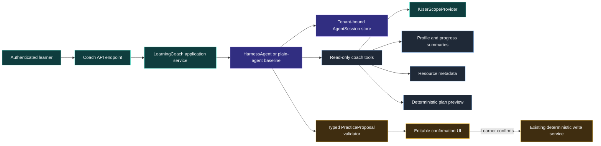

# Agent Harnesses for Sentence Studio

**Research date:** 2026-08-13
**Status:** Recommendation
**Decision:** Conditional pilot; do not make a broad migration

## Executive summary

Microsoft now provides a stable, prebuilt agent harness for .NET. The feature is part of Microsoft Agent Framework, not the core `Microsoft.Extensions.AI` package. The `Microsoft.Agents.AI.Harness` package adds the `AsHarnessAgent(...)` extension to any `IChatClient`.

The harness is for long, multi-step work. It adds tool invocation, session state, per-model-call history persistence, planning modes, todo state, file memory, tool approval, and OpenTelemetry. Some optional features remain experimental. The framework also leaves key production limits to the application, including rate, wall-clock, token, and cost limits.

Sentence Studio should not put a harness around all AI calls. Most current AI work is a good fit for one typed model call. The deterministic plan and import pipelines must also remain deterministic.

The best product candidate is a feature-flagged, server-hosted **Learning Coach**. It would:

1. Read a trusted, user-scoped summary of profile, progress, recent activity, and resources.
2. Ask at most two questions about the learner's current goal and constraints.
3. Call the existing deterministic planner to create a preview.
4. Explain the preview with evidence.
5. Return a typed proposal that the application can show, edit, and confirm.

The agent must not write data. The application must apply an accepted proposal through existing services.

The first engineering step should remove or port the unused preview-era agent code and then upgrade the Agent Framework package set. The first evaluation step should compare a plain `ChatClientAgent` with a `HarnessAgent`, using the same tools, instructions, and evaluation set. Continue with the harness only if its session, planning, approval, and observability features give measurable value.

## Recommendation at a glance

| Question | Recommendation |
|---|---|
| Adopt the harness across Sentence Studio? | No |
| Run a narrow harness pilot? | Yes, after the readiness work in this report |
| First product pilot | Goal-based Learning Coach, weekly or on demand |
| Runtime location | API/server |
| First tool surface | Read-only and request-scoped |
| First write surface | None |
| Conversation activity | Keep the fast turn loop; use a plain agent session only if history management is refactored |
| Daily plan | Keep deterministic; let the coach provide constraints and explanations |
| Import pipeline | Keep deterministic; consider a staff-only draft/recovery assistant later |
| Multi-agent, shell, file access, background agents | Do not use in the first pilot |
| Rollout | Internal flag, then opt-in cohort, then proposal confirmation |

## 1. Scope and research method

This investigation used five passes:

1. A structural survey of Sentence Studio's current AI paths.
2. A trace of request, state, tool, and persistence flows.
3. A review of the current Microsoft Agent Framework API and package surface.
4. A comparison with current agent-design guidance and Sentence Studio risks.
5. A product and architecture synthesis.

Sources include:

- Microsoft Learn and Microsoft Agent Framework source and samples.
- Current repository code, with file and line citations.
- First-party guidance from Anthropic, OpenAI, and Google Cloud.
- Independent architecture and language-learning specialist reviews.

Confidence labels have these meanings:

- **High:** Directly verified in source or first-party documentation.
- **Medium-high:** A strong recommendation supported by several verified facts.
- **Medium:** A recommendation based on verified facts.
- **Low:** An open question that needs a spike or measurement.

## 2. What the Microsoft harness is

### 2.1 Package and API

The harness is in the stable `Microsoft.Agents.AI.Harness` package. It consumes the `Microsoft.Extensions.AI.IChatClient` abstraction and exposes this construction pattern:

```csharp
using Microsoft.Agents.AI;
using Microsoft.Extensions.AI;

AIAgent agent = chatClient.AsHarnessAgent(new HarnessAgentOptions
{
    Name = "learning-coach",
    ChatOptions = new ChatOptions
    {
        Instructions = "Help the learner select a useful practice session.",
        Tools = [/* narrow, user-scoped tools */],
    },
});
```

This is an Agent Framework feature that extends MEAI. It is not an `IChatClient` middleware and it is not a new MEAI client implementation. The result is a normal `AIAgent` with a composed runtime around an `IChatClient`.

**Sources:** [Microsoft Learn: Agent Harness](https://learn.microsoft.com/agent-framework/concepts/harness), [Microsoft Learn: Get started with the harness](https://learn.microsoft.com/agent-framework/get-started/harness), [ChatClientHarnessExtensions.cs](https://github.com/microsoft/agent-framework/blob/main/dotnet/src/Microsoft.Agents.AI.Harness/ChatClientHarnessExtensions.cs).
**Confidence:** High.

### 2.2 Included capabilities

The .NET harness composes these capabilities:

| Capability | Default behavior | Sentence Studio position |
|---|---|---|
| Function invocation | Enabled, with a configurable iteration limit | Keep, but set a small limit |
| Per-service-call history persistence | Enabled | Keep |
| Todo tracking | Enabled | Test against a plain-agent baseline |
| Plan and execute modes | Enabled | Application controls mode changes |
| File memory | Enabled | Disable for the first pilot |
| Agent skills discovery | Enabled | Disable for the first pilot |
| Provider web search | Enabled when supported | Disable for the first pilot |
| Tool auto-approval | Standing and "do not ask again" support is enabled | Disable auto-approval and register no write tools |
| OpenTelemetry | Enabled | Keep with sensitive content disabled |
| Compaction | Opt-in and experimental in .NET; active only when token bounds or a custom strategy are supplied | Defer until long sessions prove a need |
| File access | Opt-in and experimental | Do not use |
| Background agents | Opt-in and experimental | Do not use |
| Looping | Opt-in and experimental | Do not use |
| Shell execution | Separate, pre-release tool package | Do not use |

The harness defaults are made for research, coding, and data-analysis agents. They are too broad for a learner-facing product unless the application turns off the capabilities that it does not need.

On a server, default file memory uses `<current-working-directory>/agent-file-memory`, and default skills discovery starts at the process current working directory. These locations are process-wide, not user-partitioned, and can grow or change outside a learner session. Disabling both is a tenant-safety requirement for the pilot.

**Sources:** [Microsoft Learn: Harness capability matrix](https://learn.microsoft.com/agent-framework/concepts/harness#harness-capability-matrix), [Microsoft release announcement](https://devblogs.microsoft.com/agent-framework/the-microsoft-agent-framework-harness-is-now-released/).
**Confidence:** High.

### 2.3 What the harness does not provide

The application still owns:

- Authentication and tenant authorization.
- Input and output length limits.
- Rate limits.
- Total token and cost limits.
- Wall-clock timeouts.
- Tool argument validation.
- Idempotency and transaction behavior.
- Session encryption, ownership, expiry, and deletion.
- End-to-end evaluations.
- A user interface for progress and approval.

The default plan-to-execute transition is an instruction to the model. It is not a hard authorization control. Application code must own any state change that has product or data effects.

**Sources:** [Microsoft Learn: Agent safety](https://learn.microsoft.com/agent-framework/concepts/agents/safety), [Microsoft Learn: Planning and todos](https://learn.microsoft.com/agent-framework/agents/planning-and-todos), [Microsoft Learn: Sessions](https://learn.microsoft.com/agent-framework/concepts/agents/conversations/session).
**Confidence:** High.

## 3. Sentence Studio today

### 3.1 Most AI calls are one-shot typed operations

`AiService.SendPrompt<T>` selects a fast or reasoning client, routes through the API gateway when available, and otherwise calls `GetResponseAsync<T>` directly (`src/SentenceStudio.Shared/Services/AiService.cs:58-115`). Activity services use this method for translation, grading, stories, diary feedback, shadowing, cloze generation, and other typed results.

The API has the same one-request shape. `/api/v1/ai/chat` resolves a tiered client, while `/api/v1/ai/chat-messages` uses the default unkeyed client. Both call `GetResponseAsync` once for text or typed output (`src/SentenceStudio.Api/Program.cs:553-650`).

These calls do not need planning, todos, file memory, approval, or autonomous loops. A harness would add latency, cost, state, and failure modes without adding task value.

**Finding:** Keep one-shot activity generation and grading on `IChatClient`.
**Confidence:** High.

### 3.2 The live Conversation activity does not use the agent service

The live page injects `ConversationService`, not `IConversationAgentService` (`src/SentenceStudio.UI/Pages/Conversation.razor:189`). It calls:

- `ConversationService.StartConversation(...)` at `src/SentenceStudio.UI/Pages/Conversation.razor:288-305`.
- `ConversationService.ContinueConversation(...)` at `src/SentenceStudio.UI/Pages/Conversation.razor:317-365`.

`ConversationService` renders the full conversation history into a Scriban prompt and sends one typed request for each turn (`src/SentenceStudio.AppLib/Services/ConversationService.cs:172-228`).

This design repeats history on every request, but it keeps the turn loop simple and fast. If Conversation needs session-based history, a plain `ChatClientAgent` plus `AgentSession` is a closer fit than the full harness.

**Finding:** Do not use the harness in the real-time conversation turn loop.
**Confidence:** High for the current path; medium for the future plain-agent recommendation.

### 3.3 The registered agent path is unused and incomplete

`AddConversationAgentServices` registers `ConversationAgentService` (`src/SentenceStudio.AppLib/ServiceCollectionExtentions.cs:20-27`), and both app hosts call the registration (`src/SentenceStudio.AppLib/Setup/SentenceStudioAppBuilder.cs:83-87`, `src/SentenceStudio.WebApp/Program.cs:137-146`). Repository search found no consumer of `IConversationAgentService`.

The unused service has two important gaps:

1. It creates `ConversationMemory`, but the `AsAIAgent(...)` call only receives instructions, a name, and a vocabulary tool. The memory is not supplied as an `AIContextProvider` (`src/SentenceStudio.AppLib/Services/Agents/ConversationAgentService.cs:52-77`).
2. It creates a reasoning-tier `_gradingAgent`, but `RunGradingAgentAsync` calls the default `_chatClient` directly (`src/SentenceStudio.AppLib/Services/Agents/ConversationAgentService.cs:234-264`).

`ConversationMemory` itself implements `AIContextProvider`, extracts topics and vocabulary, and serializes state (`src/SentenceStudio.Shared/Services/Agents/ConversationMemory.cs:21-209`). The provider is present, but the current agent does not use it.

**Finding:** Do not use `ConversationAgentService` as the base for the harness pilot. Remove it or repair it in a separate task after its intended future is clear.
**Confidence:** High.

The current code also uses preview-era Agent Framework APIs. The stable API uses `AgentSession` instead of `AgentThread`, `CreateSessionAsync()` instead of `GetNewThreadAsync()`, and different `AIContextProvider` extension points. The unused service and memory provider must be removed or ported before the stable package upgrade can compile.

**Sources:** [Current AIAgent source](https://github.com/microsoft/agent-framework/blob/main/dotnet/src/Microsoft.Agents.AI.Abstractions/AIAgent.cs), [Current AIContextProvider source](https://github.com/microsoft/agent-framework/blob/main/dotnet/src/Microsoft.Agents.AI.Abstractions/AIContextProvider.cs).
**Confidence:** High.

### 3.4 The existing long workflows should stay deterministic

The video import path already has explicit stages:

`fetch transcript -> clean transcript -> extract vocabulary -> transactional save`

Each stage updates a persistent status, and the service has stale-job cleanup and retry behavior (`src/SentenceStudio.Shared/Services/VideoImportPipelineService.cs:81-140`, `src/SentenceStudio.Shared/Services/VideoImportPipelineService.cs:187-257`). Resource creation uses an explicit database transaction and assigns `UserProfileId` from the import record (`src/SentenceStudio.Shared/Services/VideoImportPipelineService.cs:353-375`).

The daily plan path is deterministic first. `PlanService` resolves the authenticated user, calls a deterministic generator by default, and uses the LLM generator only when explicitly selected. It falls back to deterministic output if the LLM returns no result (`src/SentenceStudio.Shared/Services/Plans/PlanService.cs:106-173`). The generator threads user identity into the builder (`src/SentenceStudio.Shared/Services/Plans/DeterministicPlanGenerator.cs:31-60`).

These workflows already have code-defined order, state, validation, and recovery. An autonomous planner would make them less predictable.

**Finding:** Keep the import and plan cores deterministic. Use an agent only around ambiguous input or explanation.
**Confidence:** High.

### 3.5 User scope is the first safety boundary

The safe server pattern already exists. `IUserScopeProvider` documents a fail-closed contract when no user identity is available (`src/SentenceStudio.Shared/Services/Plans/IUserScopeProvider.cs:3-22`). The API implementation honors that contract through its throwing `UserProfileId` member: it reads the trusted `user_profile_id` claim and throws when it cannot resolve it (`src/SentenceStudio.Api/Plans/HttpUserScopeProvider.cs:7-46`).

The current `VocabularyLookupTool` does not use this boundary. It calls a repository method that depends on ambient active-user preferences, catches all exceptions, and returns a normal empty result (`src/SentenceStudio.Shared/Services/Agents/VocabularyLookupTool.cs:27-77`). The repository prevents an unfiltered query when no active profile exists, but it returns an empty list instead of an explicit authorization failure (`src/SentenceStudio.Shared/Data/LearningResourceRepository.cs:95-109`). That prevents exposure but does not meet the explicit-failure contract needed for an agent tool.

The current `Conversation` and `ConversationMemoryState` models also have no `UserProfileId` (`src/SentenceStudio.Shared/Models/Conversation.cs:8-53`, `src/SentenceStudio.Shared/Models/ConversationMemoryState.cs:10-47`). They must not be reused as a multi-tenant harness session store.

**Finding:** Agent tools must derive identity below the model from request-scoped application services. A model must never receive or select `userId` as a tool argument.
**Confidence:** High.

## 4. Current and proposed data flow

### 4.1 Current dominant path


This path is suitable for bounded, typed work.

### 4.2 Proposed coach path



The important boundary is after `PracticeProposal`. The model can propose. It cannot apply.

## 5. Candidate uses

| Candidate | Harness fit | Product value | Risk | Recommendation |
|---|---:|---:|---:|---|
| Goal-based Learning Coach | High | High, indirect | Medium | First pilot |
| Agentic Conversation tutor | Low | Conversation itself is high value | High latency and over-scaffolding | Keep the turn loop simple |
| Content import assistant | Medium to high | High content-supply value | High silent-corruption risk | Second pilot, staff only |
| Agentic daily-plan generator | Low | Low incremental value | Pedagogy drift | Keep deterministic |
| Weekly reflection coach | Medium | Medium to high | L1 talk can replace practice | Fold into the Learning Coach |
| Internal research or diagnostics agent | High | High dogfood value | Low if isolated | Useful engineering spike |

### 5.1 Why the Learning Coach is the best product pilot

The coach has the four conditions that justify model-directed work:

1. Learner input can be open ended: "I have eight minutes, no audio, and a trip next week."
2. The answer needs several data sources.
3. The work can run on demand or weekly, outside a tight activity loop.
4. The best response depends on learner intent, so code cannot define every path.

The coach does not teach directly. Its learning objective is **metacognitive regulation and skill balance**. It helps the learner select and complete useful practice.

The agent should translate free text into structured constraints. The deterministic planner should still select activities and items.

```text
learner intent
    -> agent extracts constraints
    -> deterministic planner creates preview
    -> agent explains the evidence
    -> learner edits or confirms
    -> application applies
```

**Confidence:** Medium-high.

### 5.2 Why Conversation is not the first harness target

Conversation needs low latency and a high ratio of target-language input and output. Planning, tool calls, and meta-commentary can make each turn slower and can move attention away from meaning.

Use agent intelligence before or after the live conversation:

- Before: select a scenario, goal, and difficulty band.
- After: summarize recurring errors and update deterministic learning signals.

Do not put a long autonomous loop inside each learner turn.

**Confidence:** Medium-high.

### 5.3 Why import is a later target

Import has real multi-step work and can tolerate latency. It is a strong technical fit when the source is ambiguous or a normal pipeline stage fails.

It is not the safest first product pilot. A wrong plan affects one session. A wrong gloss, lemma, or example can remain in spaced repetition for months.

A future import agent should create a draft with provenance. A human must review it before deterministic code saves it.

**Confidence:** Medium-high.

## 6. General guidance for effective harnesses

### 6.1 Start with the simplest system

Anthropic separates workflows from agents:

- A workflow follows a code-defined path.
- An agent lets the model select steps and tools.

It recommends single calls or workflows when they solve the task. Google gives the same guidance for predictable or single-call work. Microsoft provides both a basic `ChatClientAgent` and the full harness for this reason.

**Application to Sentence Studio:** keep typed activity calls, plan generation, and import state machines simple.

**Sources:** [Anthropic: Building effective agents](https://www.anthropic.com/engineering/building-effective-agents), [Google Cloud: Choose an agent design pattern](https://docs.cloud.google.com/architecture/choose-design-pattern-agentic-ai-system), [Microsoft harness release](https://devblogs.microsoft.com/agent-framework/the-microsoft-agent-framework-harness-is-now-released/).
**Confidence:** High.

### 6.2 Start with one agent

A single agent is easier to evaluate, secure, and operate. Multi-agent systems add context transfer, access control, cost, latency, and failure modes.

**Application to Sentence Studio:** no background agents or specialist handoffs in the first pilot.

**Source:** [Google Cloud: Choose an agent design pattern](https://docs.cloud.google.com/architecture/choose-design-pattern-agentic-ai-system).
**Confidence:** High.

### 6.3 Make state explicit and resumable

Long-running agents fail when the next run cannot see prior progress. Session state must contain clear progress, pending work, and a clean resume point. It must also be tied to the same agent configuration and tenant.

**Application to Sentence Studio:** persist a versioned `AgentSession` under an application-owned session ID. Never return a provider session ID as an authorization token.

Live evidence of this class of gap in Sam's current conversational layer — a learner's short
follow-up ("yes") to Sam's own preceding offer failing to resolve because the referent is not
durably tracked across the turn — is captured as a candidate future opportunity in
`docs/sam-future-opportunities.md` (Entry 1), pending Captain/Zoe review.

**Sources:** [Microsoft Learn: Sessions](https://learn.microsoft.com/agent-framework/concepts/agents/conversations/session), [Anthropic: Effective harnesses for long-running agents](https://www.anthropic.com/engineering/effective-harnesses-for-long-running-agents).
**Confidence:** High.

### 6.4 Treat tool design as product design

Tool names, descriptions, argument shapes, errors, and limits are part of the agent-computer interface. A good tool makes the correct action easy and the wrong action difficult.

Tool rules for Sentence Studio:

- Use small, purpose-specific tools.
- Do not expose repositories directly.
- Do not accept user identity as an argument.
- Validate all ranges and string lengths.
- Return explicit failure results or exceptions. Do not return an empty success after an operational error.
- Make retries safe and idempotent.
- Keep read and write operations separate.

**Sources:** [Anthropic: Building effective agents](https://www.anthropic.com/engineering/building-effective-agents), [Microsoft Learn: Agent safety](https://learn.microsoft.com/agent-framework/concepts/agents/safety).
**Confidence:** High.

### 6.5 Use least privilege and hard approval gates

Prompt instructions are not authorization. The model and all tool output are untrusted.

For the first pilot:

- Disable file memory.
- Disable file access.
- Disable skills.
- Disable web search.
- Disable background agents.
- Disable loops.
- Disable harness auto-approval.
- Register only read-only tools.
- Let the application perform all writes after confirmation.

Later, if a write tool is necessary, use an application-owned approval gate and require an idempotency key. The built-in harness supports standing and auto-approval rules, so it is not the authorization boundary. The tool must still check authorization after approval.

**Sources:** [Microsoft Learn: Agent safety](https://learn.microsoft.com/agent-framework/concepts/agents/safety), [OpenAI: Building governed AI agents](https://developers.openai.com/cookbook/examples/partners/agentic_governance_guide/agentic_governance_cookbook).
**Confidence:** High.

### 6.6 Add deterministic stop and budget controls

Model behavior is probabilistic. Stop conditions must not be.

Recommended first limits:

- At most six tool/model iterations per request.
- At most two clarification questions before a proposal.
- One active run per user.
- A server wall-clock timeout.
- A model output-token cap.
- A per-user daily and weekly cost cap.
- Cancellation that returns a clear incomplete state.

These are starting values, not framework defaults. Tune them from traces and evaluations.

**Sources:** [Anthropic: Building effective agents](https://www.anthropic.com/engineering/building-effective-agents), [Google Cloud: Loop pattern risks](https://docs.cloud.google.com/architecture/choose-design-pattern-agentic-ai-system), [Microsoft Learn: Agent safety](https://learn.microsoft.com/agent-framework/concepts/agents/safety).
**Confidence:** Medium.

### 6.7 Instrument first, but do not log learner content

Trace:

- Agent runs.
- Tool names and status.
- Model and tool latency.
- Token use and estimated cost.
- Stop reason.
- Approval and cancellation.
- Proposal validation.

Do not record raw prompts, tool arguments, tool results, diary content, or full session state in production telemetry.

**Source:** [Microsoft Learn: Agent safety](https://learn.microsoft.com/agent-framework/concepts/agents/safety).
**Confidence:** High.

### 6.8 Evaluate trajectories and learner outcomes

Output quality is not enough. Evaluations must inspect:

- Whether the agent chose the correct tools.
- Whether it stopped.
- Whether each tool call used valid arguments.
- Whether the result is grounded in tool data.
- Whether the agent respected learner and data boundaries.

For long-running tasks, test resume behavior after every meaningful step. For user-facing work, also measure the learning outcome and the time removed from practice.

**Sources:** [Anthropic: Effective harnesses for long-running agents](https://www.anthropic.com/engineering/effective-harnesses-for-long-running-agents), [OpenAI: Building governed AI agents](https://developers.openai.com/cookbook/examples/partners/agentic_governance_guide/agentic_governance_cookbook).
**Confidence:** High.

## 7. Proposed Learning Coach contract

### 7.1 Read-only tools

| Tool | Returns | Important rule |
|---|---|---|
| `get_learner_profile_summary` | Target language, native language, goals, current settings | Exclude email and other identity data |
| `get_practice_balance` | Aggregate time and activity types for 7, 14, or 30 days | Bound the date range |
| `get_vocabulary_due_summary` | Counts, difficulty bands, lapse rates, tags | Redact due terms, glosses, and examples |
| `get_resource_catalog` | Owned resource metadata and capability flags | No full diary or private text |
| `preview_practice_plan` | A deterministic plan skeleton for validated constraints | No database write |

No tool accepts `userId`. Each tool resolves it through `IUserScopeProvider`.

### 7.2 Typed output

The agent returns one `PracticeProposal`:

- Time budget.
- Audio or text constraint.
- Goal tag.
- Deterministic plan preview ID.
- Short evidence list.
- Short explanation.
- Agent configuration version.

The application validates the proposal against the planner output. If validation fails, it rejects the proposal. It does not ask the model to repair a security or ownership failure.

### 7.3 Session record

A new session store should include:

- Application session ID.
- `UserProfileId`.
- Agent name and configuration version.
- Serialized `AgentSession`.
- Created, updated, and expiry times.
- Status and stop reason.

The store must support user-visible deletion and feature-flag rollback. Do not reuse `ConversationMemoryState`.

### 7.4 Learning safeguards

The coach must not reduce target-language practice.

Required safeguards:

- Redact any word or answer that is due in the proposed session.
- Use category-level evidence instead of exposing answer content.
- Exclude diary text by default.
- Make the coach optional and easy to skip.
- Keep the deterministic "Today's plan" as the fastest path.
- Never lower the deterministic difficulty floor.
- Do not claim a formal proficiency level.
- Do not promise a time to fluency.
- Show the date range and facts behind each recommendation.
- Let the learner edit or reject every proposal.

## 8. Readiness work before the pilot

### P0: Existing agent cleanup

Decide whether to remove or repair `ConversationAgentService` and `ConversationMemory` before the package upgrade. Their current registration makes them look active, but the product does not call them, and their preview-era APIs do not compile against the stable package set. Keep the cleanup as a distinct change, then upgrade the package set.

### P0: Package compatibility spike

The repository currently pins:

- `Microsoft.Agents.AI` `1.0.0-preview.260121.1`.
- `Microsoft.Agents.AI.OpenAI` `1.0.0-preview.260121.1`.
- `Microsoft.Extensions.AI.Abstractions` `9.5.0`.
- `Microsoft.Extensions.AI.OpenAI` `10.2.0-preview.1.26063.2`.

See `Directory.Packages.props:39-42`.

The harness is a newer stable package and is not referenced today. Upgrade the Agent Framework package set in an isolated change. Compile and run the existing AI paths before any coach work.

The upgrade is breaking for the two files that use the old Agent Framework preview:

- `ConversationAgentService` uses `AgentThread` and `GetNewThreadAsync()`.
- `ConversationMemory` overrides context-provider methods that changed in the stable API.

Decide whether to remove or port this unused path before the package upgrade. Removing it is the smaller option because the live Conversation page does not call it.

### P0: Server-side identity and tools

- Build tools as scoped server services.
- Resolve the owner with the throwing `IUserScopeProvider.UserProfileId` member.
- Do not use `TryGetUserProfileId` in an agent tool path.
- Add cross-user negative tests.
- Do not expose the current `VocabularyLookupTool` until it uses the safe scope and explicit failure behavior.

### P0: Session security

- Use a new tenant-bound session record.
- Add a configuration version.
- Encrypt and access-control serialized state.
- Define expiry and deletion.
- Reject sessions owned by another user.
- Reject or migrate sessions after an incompatible agent configuration change.

### P0: Resource controls

- Add request and user quotas.
- Add a wall-clock timeout.
- Add iteration and output limits.
- Add cancellation and an explicit incomplete result.

### P0: Evaluation baseline

Create the same contract with:

1. A deterministic or plain `ChatClientAgent` baseline.
2. A `HarnessAgent` implementation.

Run the same tool set and evaluation corpus against both. The harness must show enough benefit to pay for its extra latency, cost, state, and operating complexity.

## 9. Suggested pilot configuration

The exact code depends on the package spike. The policy should be equivalent to:

```csharp
var options = new HarnessAgentOptions
{
    Name = "learning-coach",
    DisableFileMemory = true,
    DisableAgentSkillsProvider = true,
    DisableWebSearch = true,
    DisableToolAutoApproval = true,
    MaximumIterationsPerRequest = 6,
    ChatOptions = new ChatOptions
    {
        Instructions = LearningCoachInstructions,
        MaxOutputTokens = 1_200,
        Tools = readOnlyCoachTools,
    },
};
```

Do not configure:

- `FileAccessStore`.
- `BackgroundAgents`.
- `LoopEvaluators`.
- Shell tools.

Use an application-controlled mode transition if plan and execute modes remain enabled. A model-issued `mode_set` is not permission to mutate data.

## 10. Rollout plan

### Stage 0: Compatibility and baseline

- Remove or port the unused preview-era agent path.
- Upgrade the Agent Framework package set in isolation.
- Run all current typed AI paths.
- Build a plain-agent Learning Coach baseline.
- Build the harness implementation behind the same interface.
- Add traces, quotas, and evaluations.

### Stage 1: Internal, read-only dogfood

- Enable for Captain and the Squad test account.
- Use web and macOS clients against the server endpoint.
- Allow profile, progress, resource, and deterministic-preview tools only.
- Keep all proposals non-persistent.

### Stage 2: Opt-in product pilot

- Add an on-demand entry point and one optional weekly prompt.
- A/B test against the deterministic plan plus a static rule-based explanation.
- Keep the normal plan path unchanged.

### Stage 3: Confirmed application writes

- Return a typed proposal.
- Show a plan diff.
- Let the learner edit or reject it.
- Let the application call the existing write service after confirmation.
- Do not give the agent a write tool.

### Stage 4: Staff import assistant

If the coach proves the harness, test a staff-only import draft assistant. Require provenance, validation, and human review before persistence.

## 11. Measures and stop rules

These are recommended starting targets.

### Safety and operation

| Measure | Target |
|---|---:|
| Cross-user data exposure | 0 |
| Answer-leak rate | Less than 1 percent and trending to 0 |
| Tool-call success | More than 98 percent |
| Proposal validation failures | Less than 2 percent |
| Runs stopped by hard limits | Measured and reviewed; no silent continuation |
| Coach duration | At most 60 seconds median and 90 seconds p95 |

### Learning and product

| Measure | Target |
|---|---:|
| Target-language time per session | Not lower than control by more than 5 percent |
| Proposed-session completion | At least control; aim for 10 percent relative improvement |
| Learners with three or more skill types per week | Aim for 15 percentage-point improvement |
| Delayed recall after at least seven days | Not worse than control |
| Proposal acceptance | Preferred range of 40 to 85 percent; investigate outside this range |
| Unsupported pedagogical claims | Less than 2 percent |

An acceptance rate below 40 percent can mean that proposals are not useful. A rate above 85 percent needs review. A rate above 90 percent can mean that learners no longer exercise meaningful choice.

Stop the pilot if:

- Target-language time falls by more than 5 percent.
- The answer-leak rate cannot go below 1 percent.
- Cost exceeds the agreed cap without a measured product gain.
- The tool or session boundary exposes data across users.
- Proposal acceptance remains below 40 percent after two iterations, or remains above 90 percent without a measured downstream gain.
- The harness does not beat the plain-agent baseline enough to justify its complexity.

## 12. Final decision

**Conditional go.**

Build a small, server-side Learning Coach experiment. Keep it read-only. Compare `HarnessAgent` with a plain-agent implementation. Use the harness only if its explicit state, planning, approval, and observability improve the result enough to justify the added cost and complexity.

Do not:

- Wrap existing one-shot grading and generation calls.
- Replace the deterministic planner.
- Replace the deterministic import state machine.
- Put a long autonomous loop in the Conversation activity.
- Enable broad harness defaults without review.
- Trust prompt instructions as a data or authorization boundary.

The longer-term opportunity is a goal-based study assistant that works across days, not a chat bot that inserts itself into every learning turn.

## 13. Key findings

1. The feature is a stable Microsoft Agent Framework package that extends `IChatClient`; it is not part of the base MEAI package. **Confidence: High.**
2. Sentence Studio's current AI workload is mainly bounded, typed, one-shot work and should remain that way (`src/SentenceStudio.Shared/Services/AiService.cs:69-115`). **Confidence: High.**
3. The live Conversation page does not use the registered agent service (`src/SentenceStudio.UI/Pages/Conversation.razor:189`, `src/SentenceStudio.UI/Pages/Conversation.razor:288-365`). **Confidence: High.**
4. The unused agent service creates memory but does not attach it to its agent, and it bypasses its reasoning grading agent (`src/SentenceStudio.AppLib/Services/Agents/ConversationAgentService.cs:52-77`, `src/SentenceStudio.AppLib/Services/Agents/ConversationAgentService.cs:234-264`). **Confidence: High.**
5. The deterministic plan and import services already have the state and recovery properties that an agent would weaken (`src/SentenceStudio.Shared/Services/Plans/PlanService.cs:131-173`, `src/SentenceStudio.Shared/Services/VideoImportPipelineService.cs:187-257`). **Confidence: High.**
6. The first agent safety boundary must be trusted user scope, not a model argument or ambient unscoped state (`src/SentenceStudio.Shared/Services/Plans/IUserScopeProvider.cs:3-22`, `src/SentenceStudio.Api/Plans/HttpUserScopeProvider.cs:22-46`). **Confidence: High.**
7. A Learning Coach is the best product fit because it is open ended, multi-source, low frequency, and outside the activity loop. **Confidence: Medium-high.**
8. A plain-agent baseline is required because current guidance says to use the simplest architecture that works. **Confidence: High.**

## 14. Research coverage

### Explored

- Current `IChatClient` registration and gateway path.
- Current activity-level typed AI calls.
- Live Conversation path and unused agent path.
- Existing conversation memory implementation.
- Deterministic plan and video import paths.
- User-scope boundary.
- Microsoft harness API, capabilities, defaults, sessions, approvals, safety, and release state.
- General first-party agent design guidance.
- Product and learning-value candidate analysis.

### Partially explored

- Exact NuGet compatibility between the repository's old preview package set and the current stable harness.
- The best persistent `ChatHistoryProvider` for the API host.
- The exact shape of a read-only deterministic plan-preview service.
- Model-specific behavior for the configured Foundry deployments.

### Not explored

- A compiled harness proof of concept.
- Real latency and token use against Sentence Studio data.
- Agent session schema migration across package versions.
- Production evaluation scores.
- A user-tested coach interface.

### Open questions

1. Does the stable package set compile across all Sentence Studio target frameworks?
2. Does `HarnessAgent` give enough value over `ChatClientAgent` for a short coach interaction?
3. Should the coach use harness todos internally, or should all plan state remain in application code?
4. Which progress facts improve a proposal without leaking upcoming answers?
5. What daily and weekly token budget is acceptable per learner?
6. How should the user inspect and delete coach memory?
7. Which agent configuration changes invalidate a stored session?

## References

- Microsoft Learn, [Agent Harness](https://learn.microsoft.com/agent-framework/concepts/harness).
- Microsoft Learn, [Step 6: Agent Harness](https://learn.microsoft.com/agent-framework/get-started/harness).
- Microsoft Learn, [Planning and todos](https://learn.microsoft.com/agent-framework/agents/planning-and-todos).
- Microsoft Learn, [Session](https://learn.microsoft.com/agent-framework/concepts/agents/conversations/session).
- Microsoft Learn, [Agent safety](https://learn.microsoft.com/agent-framework/concepts/agents/safety).
- Microsoft Agent Framework, [Harness source](https://github.com/microsoft/agent-framework/tree/main/dotnet/src/Microsoft.Agents.AI.Harness).
- Microsoft Agent Framework, [Harness samples](https://github.com/microsoft/agent-framework/tree/main/dotnet/samples/02-agents/Harness).
- Microsoft, [The Microsoft Agent Framework Harness is now released](https://devblogs.microsoft.com/agent-framework/the-microsoft-agent-framework-harness-is-now-released/).
- NuGet, [Microsoft.Agents.AI.Harness](https://www.nuget.org/packages/Microsoft.Agents.AI.Harness/).
- Anthropic, [Building effective agents](https://www.anthropic.com/engineering/building-effective-agents).
- Anthropic, [Effective harnesses for long-running agents](https://www.anthropic.com/engineering/effective-harnesses-for-long-running-agents).
- OpenAI, [Building governed AI agents](https://developers.openai.com/cookbook/examples/partners/agentic_governance_guide/agentic_governance_cookbook).
- Google Cloud, [Choose a design pattern for your agentic AI system](https://docs.cloud.google.com/architecture/choose-design-pattern-agentic-ai-system).
